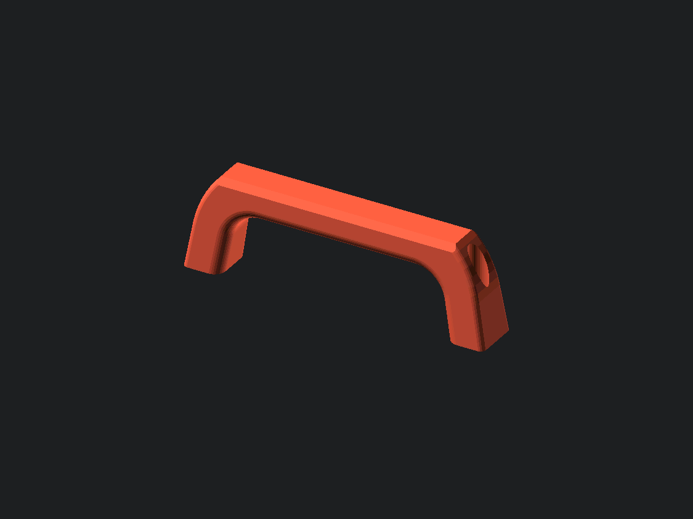
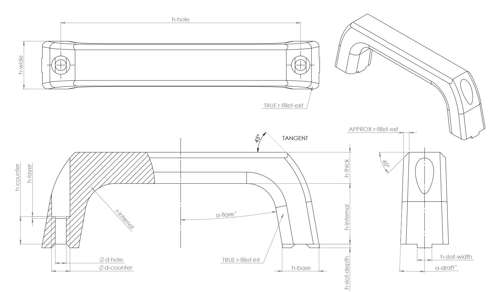
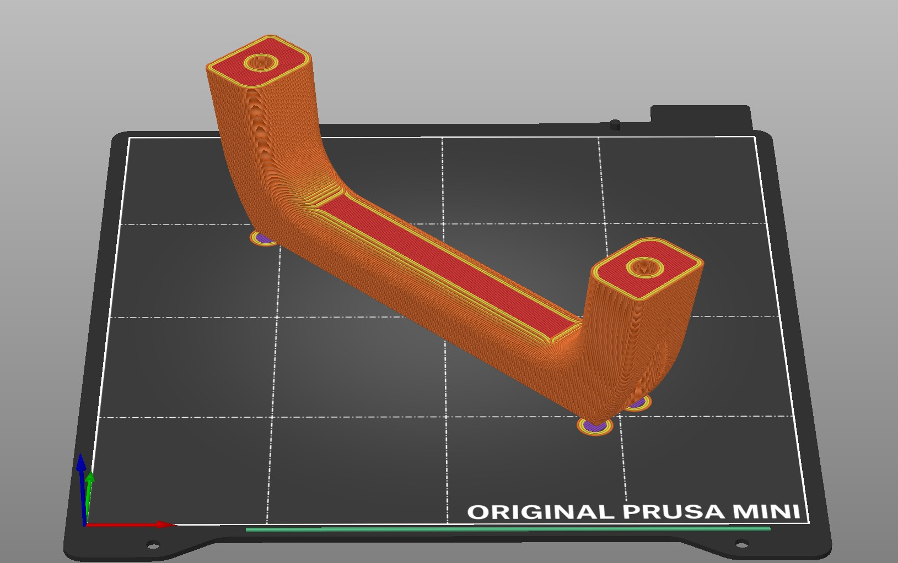

# OpenSCAD Handle
I needed a handle for a door on an enclosure and got inspired to design it in OpenSCAD. Was mainly inspired by [this design](https://www.printables.com/model/53701-prusa-mini-handle-supportless). Dimension parameters are labeled in the drawing PDF. 

You can support the model on [Printables](https://www.printables.com/model/544164-parametric-handle). 

